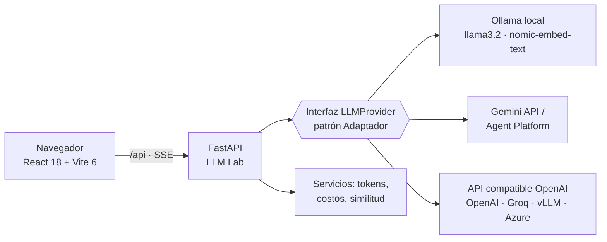

# Fundamentos de Arquitectura LLM · Sesiones 1 y 2

Repositorio del curso **Fundamentos de Arquitectura LLM** (BSG Institute) —
**Capítulo 1: Conceptos fundamentales**.

| Sesión | Tema | Guía |
|---|---|---|
| 1 | Introducción a las arquitecturas LLM: origen, evolución, funcionamiento interno e impacto | [docs/01_sesion1_introduccion_arquitecturas_llm.md](docs/01_sesion1_introduccion_arquitecturas_llm.md) |
| 2 | Tipos de modelos y servicios: decoder/encoder/encoder-decoder, nube vs. *on-premise*, casos LATAM, costos | [docs/02_sesion2_tipos_modelos_y_servicios.md](docs/02_sesion2_tipos_modelos_y_servicios.md) |

**Stack:** Python 3.12 · FastAPI · React 18 · Vite 6 · Ollama · Google Gemini Enterprise Agent Platform · Ubuntu 24.04+

---

## ¿Qué hay en este repositorio?

```
fundamentos-arquitectura-llm/
├── backend/                 API FastAPI "LLM Lab": chat, streaming, tokens, embeddings, comparador y costos
│   ├── app/providers/       Patrón Adaptador: Ollama (local), Gemini, cualquier API compatible con OpenAI
│   ├── app/services/        Tokenización, similitud coseno, estimación de costos
│   ├── app/data/pricing.yaml  Catálogo de precios ILUSTRATIVO (editable)
│   └── tests/               11 pruebas que corren sin Ollama (Ollama simulado con httpx.MockTransport)
├── frontend/                React 18 + Vite 6: interfaz de 5 laboratorios interactivos
├── labs/
│   ├── sesion1/             4 scripts: anatomía de la API, siguiente token, tokens/costo, temperatura
│   └── sesion2/             4 scripts: encoder vs decoder, portabilidad, punto de equilibrio, matriz de decisión
├── gcp-agent-platform/      Laboratorio Google Cloud en 3 partes
│   ├── parte1_consola/      Agente sin código con Agent Studio
│   ├── parte2_adk/          Agente con Google ADK publicado en Agent Runtime
│   └── parte3_docker_sin_adk/  Agente sin framework, Docker → Cloud Run
├── docs/                    Instalación, guías de sesión, evaluación con retroalimentación y glosario
├── presentacion/            Presentación PowerPoint de las sesiones 1 y 2
├── scripts/ollama_simulado.py  Plan B para equipos sin recursos para correr un modelo
├── docker-compose.yml       Ollama + backend + frontend con un comando
└── Makefile                 Atajos: setup, models, backend, frontend, test…
```

## Arquitectura del LLM Lab



La aplicación **nunca** llama directamente a un proveedor: habla con la interfaz `LLMProvider`.
Cambiar de modelo local a nube es cambiar configuración, no código — una de las ideas centrales de la Sesión 2.

## Inicio rápido (Ubuntu 24.04+)

```bash
# 0. Prerrequisitos: Python 3.12, Node 22, Ollama  →  ver docs/00_instalacion_ubuntu.md
git clone <URL-DEL-REPOSITORIO> && cd fundamentos-arquitectura-llm
make setup            # entorno virtual + dependencias + backend/.env
make models           # llama3.2:3b, llama3.2:1b, nomic-embed-text
make test             # pruebas (no requieren Ollama)

make backend          # terminal 1 → http://localhost:8000/docs
make frontend         # terminal 2 → http://localhost:5173
```

¿Sin recursos para ejecutar un modelo? `make simulado` levanta un **Ollama simulado** en el puerto 11434
con respuestas fijas: permite recorrer toda la interfaz (las respuestas no son de un LLM real).

Con Docker: `docker compose up -d --build && make docker-models` → <http://localhost:8080>.

## Los 5 laboratorios del LLM Lab

| Pestaña | Sesión | Qué se aprende |
|---|---|---|
| 1 · Playground | S1 | Roles `system`/`user`, temperatura, top-p, máx. tokens, *streaming* SSE, tiempo al primer token |
| 2 · Tokens | S1 | Cómo el modelo "ve" el texto; español vs. inglés; código, números y emojis |
| 3 · Encoder vs Decoder | S2 | *Embeddings* y similitud semántica con un modelo encoder |
| 4 · Comparador | S2 | Mismo *prompt* en varios modelos: calidad, latencia, tokens y costo |
| 5 · Costos | S2 | Costo mensual por escenario (bancario, salud, sector público), caché y costos fijos |

## API del backend

| Método | Ruta | Descripción |
|---|---|---|
| GET | `/health` | Estado del servicio y de Ollama |
| GET | `/api/providers` | Proveedores habilitados según `.env` |
| GET | `/api/models?provider=ollama` | Modelos disponibles |
| POST | `/api/chat` | Llamada completa con uso de tokens y métricas |
| POST | `/api/chat/stream` | *Streaming* con Server-Sent Events |
| POST | `/api/compare` | Mismo *prompt* en varios modelos |
| POST | `/api/tokenize` | Tokenización visual |
| POST | `/api/embeddings/similarity` | Matriz de similitud coseno |
| GET | `/api/pricing` · POST `/api/cost/estimate` | Catálogo y estimación de costos |

Documentación interactiva (Swagger): <http://localhost:8000/docs>.

## Proveedores de nube (opcional)

Edite `backend/.env`:

```bash
GEMINI_API_KEY=...                                  # https://aistudio.google.com/apikey
OPENAI_COMPAT_BASE_URL=https://api.openai.com/v1    # o Groq, Azure (v1), vLLM, LM Studio…
OPENAI_COMPAT_API_KEY=...
```

## ⚠️ Sobre los precios

`backend/app/data/pricing.yaml` contiene **valores ilustrativos** para enseñar el **método** de estimación.
Los precios reales cambian con frecuencia: verifique la página oficial de cada proveedor y actualice el archivo
antes de usarlo para una decisión real.

## Laboratorio de Google Cloud

Ver [gcp-agent-platform/README.md](gcp-agent-platform/README.md): el mismo agente de mesa de ayuda de
**TechCorp Latinoamérica** construido de tres formas (consola, ADK y Docker sin ADK) para comparar enfoques.

## Materiales docentes

- Presentación: `presentacion/Sesiones_01_02_Fundamentos_Arquitectura_LLM.pptx` (con notas del orador)
- Guía: `presentacion/Guia_Sesiones_01_02_Fundamentos_Arquitectura_LLM.docx`
- Evaluación con retroalimentación: [docs/03_evaluacion_sesiones_1_2.md](docs/03_evaluacion_sesiones_1_2.md)
- Glosario: [docs/04_glosario.md](docs/04_glosario.md)
