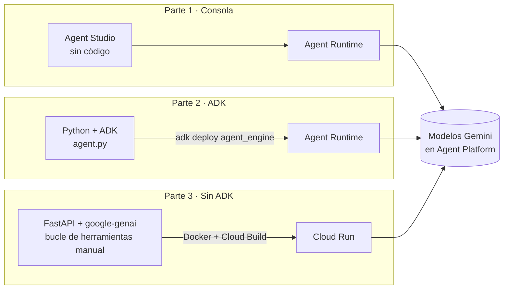

# Laboratorio Google Cloud · Gemini Enterprise Agent Platform

> **Nota de nombres (2026).** En abril de 2026 (Google Cloud Next) Google renombró **Vertex AI** como
> **Gemini Enterprise Agent Platform** (en la consola aparece como *Agent Platform*). Los flujos de trabajo
> existentes siguen funcionando sin cambios. Equivalencias que verá en documentación antigua:
>
> | Nombre anterior | Nombre actual |
> |---|---|
> | Vertex AI | Gemini Enterprise Agent Platform ("Agent Platform") |
> | Vertex AI Agent Builder / Agent Designer | **Agent Studio** (diseñador visual *low-code*) |
> | Vertex AI Agent Engine (Reasoning Engine) | **Agent Runtime** (el recurso REST sigue llamándose `reasoningEngines`) |
> | `GOOGLE_GENAI_USE_VERTEXAI=TRUE` | `GOOGLE_GENAI_USE_ENTERPRISE=TRUE` (la anterior aún funciona) |
>
> La consola de Google cambia con frecuencia. Si un botón no coincide exactamente con esta guía,
> busque la opción equivalente y consulte la [documentación oficial](https://docs.cloud.google.com/gemini-enterprise-agent-platform).

## Un mismo agente, tres formas de construirlo

Los tres ejercicios implementan el **mismo caso**: el asistente de la mesa de ayuda de TI de
**TechCorp Latinoamérica** (consulta tickets y hora de las oficinas). Así el estudiante compara
*enfoques*, no casos de uso.



| Criterio | Parte 1 · Consola | Parte 2 · ADK → Agent Runtime | Parte 3 · Docker → Cloud Run |
|---|---|---|---|
| ¿Escribe código? | No | Sí (poco) | Sí (más) |
| Bucle de herramientas | Gestionado | Lo resuelve ADK | **Lo escribe usted** |
| Sesiones / memoria | Gestionadas | Gestionadas por Agent Runtime | Usted las implementa (aquí: en memoria) |
| Infraestructura | Ninguna | Ninguna (serverless gestionado) | Contenedor propio en Cloud Run |
| Portabilidad | Baja | Media (ADK es open source; corre en otras nubes) | **Alta** (cualquier plataforma de contenedores) |
| Control y personalización | Bajo | Medio-alto | **Total** |
| Ideal para | Prototipos, usuarios de negocio | Equipos que quieren velocidad con buenas prácticas | Requisitos especiales, multi-nube, integración con sistemas existentes |

## Prerrequisitos comunes

1. Proyecto de Google Cloud con **facturación habilitada** (la prueba gratuita incluye créditos).
2. [Google Cloud CLI](https://cloud.google.com/sdk/docs/install) instalado (en Ubuntu: ver `docs/00_instalacion_ubuntu.md`).
3. Autenticación:
   ```bash
   gcloud auth login
   gcloud auth application-default login
   gcloud config set project SU_PROYECTO
   ```
4. Habilitar la API de la plataforma:
   ```bash
   gcloud services enable aiplatform.googleapis.com
   ```
5. Rol recomendado para el estudiante: **Agent Platform User** (`roles/aiplatform.user`) + permisos para Cloud Run, Cloud Build y Artifact Registry (o *Editor* en un proyecto de laboratorio).

## Orden sugerido

| Parte | Carpeta | Tiempo estimado |
|---|---|---|
| 1 | [`parte1_consola/`](parte1_consola/README.md) | 25 min |
| 2 | [`parte2_adk/`](parte2_adk/README.md) | 35 min (incluye ~8 min de despliegue) |
| 3 | [`parte3_docker_sin_adk/`](parte3_docker_sin_adk/README.md) | 35 min |

## 💸 Costos y limpieza (¡obligatorio al terminar!)

Los recursos desplegados pueden generar cargos mientras existan. Al finalizar la clase:

```bash
# Parte 1 y 2: eliminar despliegues de Agent Runtime (consola o script)
python parte2_adk/eliminar_agente.py --resource projects/.../reasoningEngines/NNNN
# Parte 3: Cloud Run + imagen + cuenta de servicio
./parte3_docker_sin_adk/cleanup.sh SU_PROYECTO
```

Recomendación docente: cree un **presupuesto con alertas** (Billing → Budgets & alerts) de USD 10 en el
proyecto del curso antes de la sesión.
