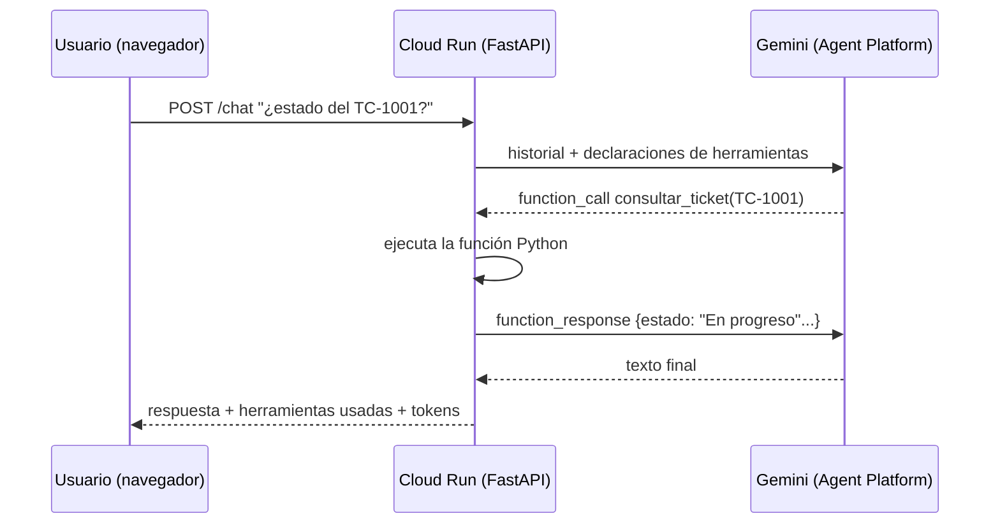

# Parte 3 · Agente SIN ADK, empaquetado con Docker y publicado en Cloud Run

**Objetivo:** construir el mismo agente **sin framework**, para entender qué hace ADK por nosotros,
y desplegarlo como un **contenedor** estándar en **Cloud Run** usando los modelos de Agent Platform.

**Duración:** 35 min · **Stack:** Python 3.12, FastAPI, `google-genai 2.25.0`, Docker, Cloud Build, Cloud Run.

## Arquitectura



La autenticación con Agent Platform **no usa API keys**: Cloud Run se ejecuta con una **cuenta de servicio**
que solo tiene el rol `roles/aiplatform.user` (principio de mínimo privilegio).

## Estructura

```
parte3_docker_sin_adk/
├── app/
│   ├── main.py          ← API FastAPI: /, /health, /chat
│   ├── agent.py         ← bucle del agente escrito a mano (¡léalo!)
│   ├── tools.py         ← herramientas (mismas que la Parte 2)
│   └── static/index.html← interfaz de chat mínima
├── tests/test_agent_loop.py  ← prueba del bucle con un Gemini simulado
├── Dockerfile
├── deploy_cloud_run.sh  ← Artifact Registry + Cloud Build + Cloud Run
├── run_local.sh         ← el mismo contenedor en su máquina
└── cleanup.sh
```

## 1 · Leer el bucle del agente (`app/agent.py`)

Los pasos que ADK oculta y que aquí son explícitos:

1. Enviar historial + herramientas al modelo (con `automatic_function_calling` **desactivado**).
2. Si la respuesta trae `function_calls`, ejecutar cada función.
3. Devolver los resultados como `function_response` y volver a llamar al modelo.
4. Repetir hasta que el modelo responda con texto (o hasta `MAX_TOOL_ROUNDS`, protección contra bucles).

## 2 · Probar sin nube

```bash
cd gcp-agent-platform/parte3_docker_sin_adk
python3.12 -m venv .venv && source .venv/bin/activate
pip install -r requirements.txt pytest
pytest -q                                   # prueba del bucle con un cliente falso
```

Con credenciales reales, sin Docker:

```bash
export GOOGLE_GENAI_USE_ENTERPRISE=TRUE GOOGLE_CLOUD_PROJECT=SU_PROYECTO GOOGLE_CLOUD_LOCATION=global
uvicorn app.main:app --reload --port 8080   # abra http://localhost:8080
```

## 3 · Probar el contenedor localmente

```bash
gcloud auth application-default login
./run_local.sh SU_PROYECTO                  # abra http://localhost:8080
```

## 4 · Publicar en Cloud Run

```bash
chmod +x deploy_cloud_run.sh
./deploy_cloud_run.sh SU_PROYECTO us-central1
```

El script: habilita APIs → crea el repositorio en **Artifact Registry** → crea la **cuenta de servicio**
con mínimo privilegio → construye la imagen con **Cloud Build** (no necesita Docker local) →
despliega en **Cloud Run** con autoescalado de 0 a 3 instancias → hace una prueba de humo.

Parámetros de Cloud Run elegidos y por qué:

| Parámetro | Valor | Razón |
|---|---|---|
| `--min-instances` | 0 | Escala a cero: no paga cuando nadie lo usa (a costa de *cold start*) |
| `--max-instances` | 3 | Tope de costo y de cuota de llamadas al modelo |
| `--concurrency` | 40 | La app es I/O-bound (espera al modelo): una instancia atiende muchas solicitudes |
| `--memory` | 512Mi | Suficiente: el modelo NO corre en el contenedor, corre en Agent Platform |
| `GOOGLE_CLOUD_LOCATION` | global | Endpoint global de modelos: mayor disponibilidad de modelos recientes |

## 5 · Limpieza

```bash
./cleanup.sh SU_PROYECTO us-central1
```

## Limitaciones intencionales (tema de las próximas sesiones)

- **Sesiones en memoria:** con 2+ instancias, dos mensajes del mismo usuario pueden caer en instancias
  distintas y "olvidar" el contexto. Solución: almacenamiento externo (Firestore, Memorystore, PostgreSQL).
- **Sin autenticación de usuarios** ni límites de uso (*rate limiting*).
- **Sin observabilidad** de tokens y costos por usuario.

Compare con la Parte 2: Agent Runtime resolvía sesiones y trazas "gratis". Esa es exactamente la
decisión de arquitectura **construir vs. adoptar plataforma**.
